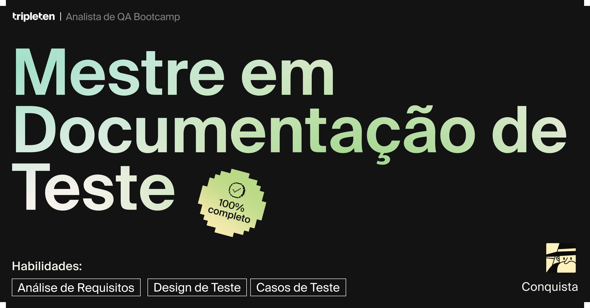

# Bootcamp QA

O Bootcamp de Analista de QA (Quality Assurance / Garantia da Qualidade) da plataforma TripleTen é um programa que oferece uma base sólida para atuar na área de QA. Durante o curso, foram abordados diversos temas essenciais, organizados em 6 Sprints, nos quais desenvolvi 5 projetos práticos. Confira os detalhes na lista abaixo:

- **Sprint 1** — Noções Básicas de Teste
- - [Projeto 1 - Clique para visualizar](https://docs.google.com/spreadsheets/d/11BHS1lKEyfQ8oXLZKpQJIQPOGRcDEar_/edit?usp=drive_link&ouid=113963170948621602440&rtpof=true&sd=true)
- **Sprint 2** — Design de Teste
- - [Projeto 2 - Clique para visualizar](https://docs.google.com/spreadsheets/d/1CwnnO2TEy_w13SuLrTpzRC2rtzxcejxq/edit?usp=sharing&ouid=113963170948621602440&rtpof=true&sd=true)
- **Sprint 3** — Teste de Aplicativos Web
- - [Projeto 3 - Clique para visualizar](https://docs.google.com/spreadsheets/d/1b232GGupOPAsS0LAcF2f6eQ1zHP1gfw9/edit?usp=sharing&ouid=113963170948621602440&rtpof=true&sd=true)
- **Sprint 4** — Teste de API
- - [Projeto 4 - Clique para visualizar](https://docs.google.com/spreadsheets/d/1Jrlakb1xjt7N2MqMIe_sZKAnRU4nDcud/edit?usp=sharing&ouid=113963170948621602440&rtpof=true&sd=true)
- **Sprint 5** — Noções básicas de Banco de Dados
- **Sprint 6** — Projeto final
- - [Projeto Final - Clique para visualizar](https://docs.google.com/spreadsheets/d/1FwepaZvBDd8SqtSfZw91-yHPJQhaUAl6/edit?usp=sharing&ouid=113963170948621602440&rtpof=true&sd=true)

Abaixo, você encontrará um resumo do conteúdo abordado em cada Sprint, além de detalhes sobre o processo de desenvolvimento de cada projeto:

------------------------------------------------------------------

## Sprint 1 — Noções Básicas de Teste

Este Sprint desenvolve as seguintes habilidades:
 
  

**Capítulo 1 - Introdução à Análise de QA**

- O que são testes de software.
- Como se tornar um analista de QA.
- O percurso da carreira do analista de QA.

**Capítulo 2 - Desenvolvimento e teste**

- Aplicação: da ideia à remoção.
- Objetivos do testador nas diferentes etapas do ciclo de vida de desenvolvimento de software.
- Etapas de desenvolvimento: testar uma tarefa.
- Teste de lançamento.

**Capítulo 3 - Checklists**

- Primeiro checklist.
- Bugs.
- Como criar um checklist de teste.

**Capítulo 4 - Relatórios de bugs**

- Relatórios de bug.
- Títulos de relatórios de bug.
- Etapas para reproduzir um bug.
- Severidade e prioridade.
- Configuração do sistema.
- Materiais adicionais: capturas de tela e capturas de vídeo.

**Capítulo 5 - Casos de teste**

- Casos de teste.
- Criar um caso de teste.
- Erros comuns ao escrever casos de teste.
- Relatório de resumo de testes.
- Teste de fumaça.
- Teste de regressão.

**Capítulo 6 - Atividades práticas do sprint 1**

- Criação de um checklist.
- Teste de regressão com checklists.
- Criação de casos de teste.
- Criação de relatórios de bug.

**Capítulo 7 - Projeto Sprint 1**

Neste projeto, a proposta foi conduzir o **Teste de Regressão** de um aplicativo de rotas chamado Urban Routes. O Urban Routes é um aplicativo que cria rotas e calcula o tempo e custo da viagem para diferentes tipos de transporte.

A interface é bem simples: há dois campos para endereços, "De" e "Para". Além disso, há três modos ("Optimal," "Flash" e "Personal"), bem como ícones para os tipos de transporte (o carro do próprio usuário, a pé, táxi, bicicleta, scooter ou compartilhamento de carro).

O objetivo do projeto foi executar casos de teste pré definidos, criados por uma equipe de QA fictícia, para o teste de regressão do Urban. As tarefas eram encontrar bugs (ou seja, a diferença entre os resultados esperados e reais) e relatar todos os bugs encontrados.

*Etapa 1 - Executar os casos de teste.*

- Os casos de teste no modelo estão formatados como uma tabela e possuem os seguintes campos: ID, Nome do caso de teste, Pré-condição, Descrição da etapa e Resultado esperado.
- Os campos necessários a preencher são: Status e ID do bug.

*Etapa 2 - Criar relatórios de bugs.*

- Para documentar os bugs encontrados, foi necessário preencher os campos: ID, Título, Etapas, Resultados Esperados e Reais e Prioridade.

**Tecnologias utilizadas**

- Google Chrome.
- Google Sheets.
- 
**Projeto**
- [Clique aqui para ver o projeto concluido!](https://docs.google.com/spreadsheets/d/11BHS1lKEyfQ8oXLZKpQJIQPOGRcDEar_/edit?usp=drive_link&ouid=113963170948621602440&rtpof=true&sd=true)

## Conclusão

No Sprint 1, foram abordados fundamentos base, como ciclo de vida de desenvolvimento de software, checklists, relatórios de bugs e casos de teste. No projeto, estes temas foram postos à pratica através de testes manuais de interface:

✔️ Com Testes de Fumaça, testar novos recursos de software.
✔️ Com Teste de Regressão, garantir que as alterações no software não criem novos erros.
✔️ Criar Relatórios de Bugs completos que descrevem problemas com o software.

-----------------------------

## Sprint 2 — Design de Teste

Este Sprint desenvolve a seguinte habilidade:
 

**Capítulo 1 - Design de Teste**

- Como são os requisitos de aplicativos e como os decompor.
- Como mapas mentais e fluxogramas podem ajudar a visualizar esses requisitos.
- O que são classes de equivalência e valores-limite e como usá-los para criar casos de teste.

**Capítulo 2 - Análise de requisitos**

- Análise de requisitos: identificação de objetos de teste.
- Decomposição de requisitos.
- Visualização de requisitos.
- Áreas cinzentas e pesquisa de requisitos.
- Testes funcionais e não funcionais.

**Capítulo 3 - Design de teste**

- Design de casos de teste.
- Testes positivos e negativos.
- Particionamento em classes de equivalência.
- Como identificar classes de equivalência.
- Como escolher valores de teste.
- Valores-limite.
- Como usar classes de equivalência e valores-limite juntos.
- Otimização de teste.
- Casos complicados.

**Capítulo 4 - Documentação de teste**

- Como criar um checklist a partir de um mapa mental.
- Como usar classes de equivalência em casos de teste.

**Capítulo 5 - Projeto Sprint 2**

Neste projeto, a tarefa consistiu em decompor e analisar detalhadamente os requisitos do recurso de compartilhamento de carros da aplicação Urban Routes (a mesma utilizada no Sprint 1). Com base nessa análise, o objetivo foi projetar o design de testes e elaborar os casos de teste para o formulário "Adicionar carteira de motorista' da aplicação". Não foi necessário testar nada ainda — o foco era apenas preparar a documentação de teste.

[Clique aqui para ver os requisitos do recurso de compartilhamento de carros da aplicação Urban Routes](https://practicum-content.s3.us-west-1.amazonaws.com/new-markets/qa-sprint-1/PTBR/v4/Requisitos_de_compartilhamento_de_carros_no_UrbanR.pdf)

*Etapa 1 - Definir as classes de equivalência e valores-limite.*

- Definir as classes de equivalência, valores-limites e escolher os valores de teste para os campos: "Nome", "Sobrenome" e "Data de nascimento".
- Criar um mapa mental e um fluxograma da interface.

*Etapa 2 - Definir as classes.*

- Definir as classes de equivalência, valores-limites de distancia e horários entre os endereços e criar um fluxograma.

*Etapa 3 - Escrever os casos de teste conforme os valores de teste escolhidos.*

- Use os valores de teste escolhidos na tarefa anterior para escrever casos de teste para o campo "Nome".

**Tecnologias utilizadas**

- Google Chrome
- Google Sheets
- Draw io
- Xmind

**Projeto**

- [Clique aqui para ver o projeto concluido!](https://docs.google.com/spreadsheets/d/1CwnnO2TEy_w13SuLrTpzRC2rtzxcejxq/edit?usp=sharing&ouid=113963170948621602440&rtpof=true&sd=true)
- [Clique aqui para ver o mapa mental.](https://drive.google.com/file/d/12mmNuoLXXPW63AS24FCLUwQQSG-sV3Pu/view?usp=sharing)
- [Clique aqui para ver o fluxograma.](https://drive.google.com/file/d/1c9_EZephUqWAJ38-M6iKN8siwZmR9V3z/view?usp=sharing)

## Conclusão

Durante o Sprint 2, o foco esteve nas técnicas de **Design de Teste**, abrangendo desde os fundamentos até a aplicação prática em atividades realizadas ao longo dos capítulo, como na criação de mapas mentais e fluxogramas, processo que não apenas aprofunda a compreensão além do que está nos requisitos, mas também proporciona uma visão holística das funcionalidades da aplicação, resultando em maior organização e fluidez durante a criação de casos de teste.

O Sprint destacou a importância de identificar objetos de teste, decompor requisitos, reconhecer áreas cinzentas e diferenciar entre requisitos funcionais e não funcionais. Também foram introduzidos conceitos fundamentais, como testes positivos e negativos, particionamento em classes de equivalência, escolha de valores de teste e definição de valores-limite. Essas práticas asseguram uma cobertura abrangente durante as verificações e promovem a otimização do fluxo de trabalho, elevando a eficiência e a eficácia dos testes.

As habilidades fundamentais conquistadas:

✔️ Aplicação de técnicas de Design de testes.
✔️ Analise abrangente de requisitos.
✔️ Escrever casos de teste completos baseados no estudo de requisitos.

Além disso, durante o Sprint 2, foram realizadas 3 atividades práticas, vou disponibilizá-las para você conferir:

- Atividade 1 - [Classes de equivalência em casos de teste.](https://docs.google.com/spreadsheets/d/1RJyks0FCGjeMuYzJ3ToUVKuGOyDjqdAC/edit?usp=sharing&ouid=113963170948621602440&rtpof=true&sd=true)
- Atividade 2 - [Classes de equivalência e valores-limite.](https://docs.google.com/spreadsheets/d/10Dk0_m4_YBjRsjO1BWU2atXawKdKUEvm/edit?usp=sharing&ouid=113963170948621602440&rtpof=true&sd=true)
- Atividade 3 - [Casos de teste para validação do campo "Nome".](https://docs.google.com/spreadsheets/d/1XjreBjlu5u1ReKvwxhR_vlUL6UzRpS-k/edit?usp=sharing&ouid=113963170948621602440&rtpof=true&sd=true)

-------------------

## Sprint 3 - Teste de Aplicativos Web

Neste Sprint desenvolve as seguintes habilidades:
 
  

**Capítulo 1 - Teste de Aplicativos Web**

- Os princípios de funcionamento de um aplicativo web.
- Testes de interface em aplicativos web.
- Testes entre plataformas e navegadores.
- Testes de adaptabilidade do layout.
- Design de testes.
  
**Capítulo 2 - Como um aplicativo web funciona**

- Aplicativo web.
- URL.
- Solicitações HTTP.
- Respostas HTTP.
- Como visualizar solicitações do front-end e respostas do back-end.
- Cookies.
- Armazenamento local.
- Cache em testes.
  
**Capítulo 3 - Teste de interface do usuário de um aplicativo web**

- Elementos da interface: parte 1.
- Elementos da interface: parte 2.
- Uma ferramenta para trabalhar com designs: Figma.
- Testes de elementos da interface.
- Formulários e teste de validação.
- Testes em textos para detectar erros.
  
**Capítulo 4 - Teste entre plataformas e navegadores**

- Testes multiplataforma.
- Como selecionar sistemas operacionais para testar um aplicativo.
- Testes entre navegadores.
- Como selecionar navegadores para testes de sofware.
  
**Capítulo 5 - Teste de design web responsivo**

- Abordagem para layouts de aplicativos web.
- Teste de design web responsivo.
- Ferramentas para testar a versão móvel de um site.
- Como selecionar resoluções de tela para teste de web design responsivo.
- Como escolher um ambiente de teste.
  
**Capítulo 6 - Design de teste para testes de aplicativos web**

- Classes de equivalência: revisão.
- Valores-limite: revisão.
- Testes positivos e negativos.
- Tabela de decisão.
- Teste de pares.
  
**Capítulo 7 - Projeto Sprint 3**

Neste projeto, o objetivo foi executar **Testes de Funcionalidade** e **Testes de Layout** da funcionalidade de compartilhamento de carros do Urban Routes. Começando pela analise dos designs e dos requisitos, seguindo para o preparo das documentações de teste para o layout e funcionalidade do formulário de reserva, para depois realizar os testes do aplicativo. Ao fim de todas as verificações, os bug identificados deveriam ser registrados na plataforma Jira, sempre descrevendo todas as etapas para reprodução do erro e anexando imagens ao relatório.

[Clique aqui para ver os requisitos do recurso de compartilhamento de carros do Urban Routes.](https://practicum-content.s3.us-west-1.amazonaws.com/new-markets/qa-sprint-3/PTBR/v6/Requisitos_da_funcionalidade_Carsharing.pdf)

[Clique aqui para ver os designs do layout do recurso de compartilhamento de carros do Urban Routes no Figma.](https://www.figma.com/file/xmXmdL9XmfkBlqlnRZdmRK/Urban-Routes-PT?type=design&node-id=1-17466&mode=design&t=KqcZZYfdODqiRZrf-0)

*Etapa 1 - Criar um checklist para o layout do formulário de reserva.*

- Escolha uma opção de corrida.
- Preste atenção à ortografia, disposição dos elementos e a aparência deles
- Se atentar aos pop-ups: "Carro reservado", "Você tem certeza que quer cancelar sua viagem?" e "Viagem cancelada".

*Etapa 2 - Criar um checklist para a funcionalidade das janelas "Método de pagamento" e Adicionar cartão"*.

- No checklist, utilize o particionamento de classes de equivalência e análise de valores-limite.
- Abranja testes positivos e negativos.

*Etapa 3 - Elaborar casos de teste para o botão "Reservar".*

*Etapa 4 - Preparar os casos de teste para a função de "locação de carro", usando de base a seção "Reservar carro" dos requisitos.*

**Ambientes de Teste**

Neste projeto, os testes de layout e da funcionalidade compartilhamento de carro foram executadas em dois ambientes:

- Google Chrome, resolução de tela 800x600.
- Mozilla Firefox, resolução de tela 1920x1080.

**Tecnologias utilizadas**

- Google Chrome.
- Mozilla Firefox.
- Google Sheets.
- Jira.
- Figma.

**Projeto**

- [Clique aqui para ver o projeto concluido!](https://docs.google.com/spreadsheets/d/1b232GGupOPAsS0LAcF2f6eQ1zHP1gfw9/edit?usp=sharing&ouid=113963170948621602440&rtpof=true&sd=true)

**Relatório de Teste**

Como tarefa adicional, foi proposto a elaboração de um resumo, um relatório dos resultados do trabalho, a fim de exercitar tal atividade que costuma ser comum no dia a dia da profissão:

###### • No ponto de vista do usuário, a aplicação Urban Routes se destaca por ser intuitiva, objetiva e de fácil manuseio. Entretanto, os inúmeros bugs, desde erros de grafia, até falhas em funções críticas como o cancelamento de uma reserva de carro, podem prejudicar a experiência do usuário, gerando frustrações e até uma possível desistência do uso do aplicativo. Durante os testes, foi possível verificar a apresentação visual, como a disposição dos elementos nas janelas e no mapa; analisar detalhadamente do fluxo de uso, desde a abertura da aplicação até a conclusão de uma reserva; assim como a lógica de funcionamento em cenários típicos, e a resposta do sistema para situações inesperadas ou de contrariedade. Emrelação aos bugs, eles ocupam a maior parte dos testes, sendo identificados 46 bugs no layout e 19 bugs na lógica de funcionalidade. No decorrer dos testes, algumas funções não puderam ser validadas, devido à uma inconsistência da aplicação em ambos ambientes de teste, mais especificamente na funcionalidade de cancelamento de uma reserva de carro, que se mostra inoperante, interrompendo o fluxo de cancelamento e impossibilitando que outros elementos de layout e lógica fossem verificados, link do bug: https://douglas-qa.atlassian.net/browse/URBUG-21. Ao concluir os testes, ficou nítido que a aplicação Urban Routes precisa ser revisada por completo antes de chegar ao usuário final, pois o lançamento no seu estado atual pode gerar sérios prejuízos aos desenvolvedores. Recomendo que, após a reformulação do aplicativo, ocorra uma reunião 1:1 entre os desenvolvedores e o gerente de testes, para que esclareçam todos aspectos sobre a aplicação, para só então dar início aos testes.

## Conclusão

Neste Sprint, o foco foi o **Gerenciamento de Bugs**, abrangendo desde a identificação de problemas, seja nos designs ou nas funcionalidades da aplicação, até a documentação detalhada em relatórios utilizando uma plataforma real, o Jira (Atlassian). Além disso, foi introduzido o teste de interface de usuário, com ênfase na verificação do layout da aplicação em diversos ambientes de teste, garantindo a qualidade da experiência do usuário em diferentes dispositivos.

As principais habilidades em testes adiquiridas foram:

✔️ Rastreamento de bugs.
✔️ Elaboração de relatórios de bug no Jira.
✔️ Teste de interface de usuário.

-----------------------

## Sprint 4 - Teste de API

Neste Sprint desenvolve as seguintes habilidades:
 
  

**Capítulo 1 - Teste de API**

- Como a arquitetura de um aplicativo com uma API e banco de dados é organizada.
- Como testar uma API.
- O que é a solução de arquitetura REST.
  
**Capítulo 2 - Introdução à API**

- Arquitetura do aplicativo.
- O que é uma API?
- Soluções de arquitetura — REST.
- HTTP: Estrutura de solicitação e resposta.
- JSON.
  
**Capítulo 3 - Testes de API com Postman**

- Postman: recursos básicos.
- Postman: Testes de API.
- URL dinâmica no Postman.
- cURL e geração de solicitação do Postman para cURL.
- Banco de dados e API
- Relatório de bugs para API.
- Documentação da API.
- Swagger.
- Apidoc.
  
**Capítulo 4 - Design de testes para teste de API**

- Testes positivos.
- Testes negativos.
- Classes de equivalência.
- Valores-limite.
- Validação de API.
- Checklist para testes de API.

**Capítulo 5 - Projeto Sprint 4**

Neste projeto, o objetivo foram os **Testes de API** utilizando a plataforma Urban.Grocers para os estudos. No case, os desenvolvedores adicionaram um novo recurso a API do Urban.Grocers, e uma nova versáo da API foi passada para você testar, as tarefas são:

- Analisar os requisitos para a nova funcionalidade do back-end do Urban.Grocers.
- Projetar os testes em um checklist para abordar as funcionalidades que precisam ser testadas.
- Testar a API através do Postman e enviar relatórios de bug ao Jira.

A nova funcionalidade do Urban.Groocers cobre diversas áreas:

- Trabalho com kits - a capacidade de adicionar produtos a um kit.
- Trabalho com serviços de entrega - a capacidade de verificar se o serviço de entrega Order and Go está disponível e quanto custa.

[Clique aqui para ver os requisitos para o back-end do Urban.Grocers.](https://practicum-content.s3.us-west-1.amazonaws.com/new-markets/qa-sprint-3/PTBR/Requisitos_para_o_back-end_do_Urban.grocers.pdf)

**Como o projeto é avaliado**

- Os checklists estão bem organizados e os testes foram projetados minuciosamente.
- Os testes foram bem realizados e todas as verificações projetadas foram executadas.
- Quais bugs foram detectados e relatados corretamente.

**Tecnologias utilizadas**

- Google Chrome.
- Google Sheets.
- Jira.
- Postman.
- DevTools.

**Projeto**

- [Clique aqui para ver o projeto concluido!](https://docs.google.com/spreadsheets/d/1Jrlakb1xjt7N2MqMIe_sZKAnRU4nDcud/edit?usp=sharing&ouid=113963170948621602440&rtpof=true&sd=true)

**Relatório de Teste**

Como tarefa adicional, a elaboração de um relatório dos resultados dos testes, a fim de exercitar tal atividade que costuma ser comum no dia a dia da profissão. O que você pode falar à equipe sobre o status de teste da parte testada do produto?

###### • Com base nos testes realizados sob as novas funcionalidades do Urban.Grocers, é evidente que as fórmulas utilizadas para calcular e filtrar as entregas precisam ser revisadas, mais barreiras precisam ser adicionadas, pois ainda existem lacunas no sistema que burlam as regras de negócios estabelecidas nos requisitos, podendo ocasionar em atrito com os clientes e prejuízos financeiros para a empresa.

## Conclusão
 
Neste ponto do curso, o Sprint me capacitou a realizar testes completos em aplicativos web, abrangendo tanto o front-end quanto o back-end, incluindo bancos de dados. Além de explorar os fundamentos da arquitetura de aplicativos, o aprendizado foi enriquecido com o uso de ferramentas essenciais para um QA, como DevTools e Postman. Agora, estou apto a testar manualmente aplicativos web de diferentes tipos e pratiquei testes de interface do usuário (IU).

As principais habilidades adquiridas incluem:

✔️ Estrutura e manipulação de HTML.
✔️ Testes de API.
✔️ Uso da ferramenta Postman para testar API.

-------------------

## Sprint 5 - Noções básicas de Banco de Dados

Este Sprint desenvolve as seguintes habilidades:
 
 

**Capítulo 1 - Noções básicas de Banco de Dados**

- O que é uma linha de comando e como interagir com um computador através de comandos.
- Como conectar a um servidor remoto via SSH.
- O que é SQL e como você pode usá-lo para manipular dados.
- Como juntar várias tabelas usando SQL.
  
**Capítulo 2 - Linha de comando**

- Introdução ao Console.
- Sistemas operacionais.
- Linha de comando.
- Conectar a um servidor remoto.
- Entendimento de onde você está.
- Exibir os conteúdos de um diretório.
- Ir de um diretório para outro.
- Gerenciar arquivos e diretórios.
- Trabalhar com arquivos de texto.
- Copiar e mover.
- Filtragem de conteúdo de arquivos.
- Dicas e truques.
- Teste: Sistemas Operacionais e o Console.

**Capítulo 3 - Noções básicas de SQL**

- Introdução ao SQL.
- Testes de banco de dados.
- Banco de dados relacional.
- Sua primeira instrução SQL.
- Fatias de dados em SQL.
- Funções de agregação.
- Conversão de tipos de dados.
- Agrupamento de dados.
- Ordenação de dados.
- Banco de dados e console.
- Alteração de dados: INSERT.
- Alteração de dados: UPDATE.
- Alteração de dados: DELETE.
- Dump de banco de dados.
- Teste: Noções básicas de banco de dados.

**Tecnologias utilizadas**

- Google Chrome.
- Cygwin Terminal.

## Conclusão

Este penúltimo Sprint abordou **Linha de Comando** e **SQL**, combinando teoria e prática de forma integrada para facilitar a compreensão e aplicação dos conceitos e comandos essenciais ao dia a dia de trabalho. Na parte de Linha de Comando, foram exploradas diversas interações com o sistema via console, como visualizar, criar e editar arquivos e diretórios pelo terminal, além de aprender a conectar-se a servidores remotos via SSH. Já no conteúdo de Banco de Dados, o foco foi aprofundado nos fundamentos de sistemas relacionais e não relacionais, incluindo a realização de testes direcionados, manipulação de dados, escrita de consultas SQL, uso de funções de agregação e criação de dumps de dados.

As principais habilidades adquiridas incluem:

✔️ Linha de comando e interações via terminal.
✔️ SQL e como você pode usá-lo para manipular dados.
✔️ Banco de dados relacional e não relacional.

--------------------

## Sprint 6 - Projeto Final

Para o projeto que marca a conclusão do Bootcamp, foram desenvolvidas três grandes tarefas, todas relacionadas ao aplicativo Urban.Scooter, um serviço que permite alugar uma scooter elétrica por alguns dias.

- A **primeira tarefa** é um grande teste teórico e vai verificar seu conhecimento sobre os principais aspectos de teste respondendo a um questionario com perguntas semelhantes em entrevistas de emprego.
- A **segunda tarefa** é prática, o teste do aplicativo web Urban.Scooter. Ela é a maior das tarefas, e verficará se você sabe analisar e fazer o design de testes, ou seja, se você sabe como testar aplicativos da web.
- A **terceira tarefa** também prática, é o teste da API do Urban.Scooter e vai verificar se você sabe testar APIs e interagir efetivamente com back-end utilizando as ferramentas do mercado.

**Sobre as tarefas**

- Estudar a documentação do aplicativo em cada tarefa, isso inclui os requisitos e os designs.
- Criar um mapa mental para visualizar os requisitos onde for necessário.
- Dividir os recursos em blocos atômicos e definir objetos de teste.
- Fazer o design de testes para lidar com todos os requisitos.
- Aplicar classes de equivalência, valores-limite e uma tabela de decisão quando apropriado.
- Otimizar o número de testes nos testes de interface de usuário e testes lógicos dos recursos.
- Execute os casos de testes criados e faça relatórios de bugs na plataforma Jira, se necessário.
- Use o DevTools ou Postman para verificar solicitações para determinadas URLs.
 
**Tarefa 1 - Teste teorico**
[Clique aqui para ver o questionario da Tarefa 1.](https://docs.google.com/spreadsheets/d/1FwepaZvBDd8SqtSfZw91-yHPJQhaUAl6/edit?usp=drive_link&ouid=113963170948621602440&rtpof=true&sd=true)

**Tarefa 2 - Aplicação web Urban.Scooter**

[Clique aqui para ver os requisitos para o front-end do Urban.Scooter.](https://practicum-content.s3.us-west-1.amazonaws.com/new-markets/qa-final-project/PT/Requisitos_do_aplicativo_web.pdf)

[Clique aqui para ver os designs do layout do recurso de compartilhamento de carros do Urban Routes no Figma.](https://www.figma.com/file/X7gkPXl21HEdvPJr29m53v/Urban-Scooter-WEB-pt-br?type=design&node-id=0%3A1&mode=design&t=ZegvDh1XAj02Acek-1)

Lista de verificação: 
- Crie um checklist dos requisitos de recursos para a tela "Status do pedido".
- Divida os recursos em blocos atômicos e defina objetos de teste
- Deve conter os resultados dos testes que você executou e os relatórios de bugs que você criou.

Dados de validação:
- Crie testes para validar os campos da tela "Fazer pedido". Preencha-os como uma tabela de acordo com o modelo

**Tarefa 3 - API do aplicativo Urban.Scooter**

[Clique aqui para ver os requisitos para o back-end do Urban.Scooter.](https://practicum-content.s3.us-west-1.amazonaws.com/new-markets/qa-final-project/PT/Requisitos_para_o_back-end_do_aplicativo.pdf)

Checklist:
- Examine os requisitos de back-end e a documentação da API.
- Crie um checklist que contenha os resultados dos testes e relatórios de bugs.
- Teste a API em relação aos requisitos em negrito.

**Como o projeto é avaliado**

- Quão bem os casos de teste foram projetados e se os testes foram exaustivos
- Se as técnicas de design de teste foram usadas ao projetar casos de teste
- A qualidade do teste: todos os casos de teste projetados devem estar completos
- A presença de relatórios de bugs corretos após os resultados do teste
- A singularidade e exatidão das respostas às questões teóricas

**Ambientes de Teste**

Neste projeto, todos os testes da aplicação web do Urban.Scooter foram executados em dois ambientes:

- Google Chrome, resolução de tela 1280x720.
- Mozilla Firefox, resolução de tela 1920x1080.

**Tecnologias utilizadas**

- Google Chrome
- Mozilla Firefox
- Figma
- Postman
- Jira
- draw io
- Google Sheets

**Projeto Final**

- [Clique aqui para ver o projeto final concluido!](https://docs.google.com/spreadsheets/d/1FwepaZvBDd8SqtSfZw91-yHPJQhaUAl6/edit?usp=sharing&ouid=113963170948621602440&rtpof=true&sd=true)
- [Mapa mental do formulário “Para quem é a scooter”.](https://ibb.co/4dFCHQ6) 
- [Mapa mental do formulário “Locação”.](https://ibb.co/10gRg7F)

# Conclusão

Este projeto final foi uma oportunidade de consolidar e aplicar na prática todo o conteúdo aprendido ao longo dos meses de curso. As três tarefas propostas, intensas e desafiadoras, proporcionaram uma imersão no dia a dia de um QA. Alguns destaques durante o desenvolvimento foram a aplicação de diferentes metodologias de testes manuais — positivos e negativos — para web e API, além de testes de UI. Utilizei técnicas de design de testes, elaborei casos de teste, criei relatórios de bugs, manipulei dados e interagi com todas as ferramentas apresentadas ao longo do curso, como Swagger, ApiDoc, DevOps, Linha de Comando, Draw io, Jira, Figma e Postman.

Este projeto representa o resultado do meu esforço, comprometimento e aprendizado, além de validar as habilidades práticas que desenvolvi. É o marco da conquista do título de **Analista de QA** e um passo significativo na minha jornada profissional.

--------------------

##### Meu sincero agradecimento a todos que acompanharam até o final este projeto sobre minha formação como Analista de QA. Sua presença e apoio tornam essa conquista ainda mais significativa.
